# Auto Poster Generator

## Introduction

A prototype to generate posters, certificates, banners, images with custom texts using a base template. The configuration is designed to be very easy and user friendly. Another major advantage of this software is it's designed to run on very low resources, while offering flexibility.

This program can be very helpful for both education and other organization including commercial ones since the need to generate posters/certificates etc. It is one that arises in many such organizations.

Auto Poster Generator is coded using both Python and C#. The image manipulations process, which analyzes the and manipulates the image in order to  place the text is written in Python. A user friendly GUI was coded in C#, making this software both easy and modular.

The Python scripts making up the backend can be accessed and modified easily to suit a person's/organization's preferences.

## Programming Languages & Frameworks

* Python
  * Pillow
  * Textwrap
  * OS
* C#

## Configuration & Setup

* Installing Pillow

  ```
  pip install pillow
  ```

* Installing PIL

  ```
  python -m pip install Pillow
  ```


* Installing textwrap

  ```
  pip install textwrap3
  ```


## System Explained

This system generate images writing text on a base template, first we need to give the Y1, Y2 (Starting point) | X1, X2 (Ending point) coordinates.

We can write many text elements on a base template, but, the number of texts elements in all batches should be same.

### What can we do with this system?

### Input

**Note** As an input, we give this base template, here we want to write the tutorial number on the first box, and the tutorial heading on the second big box, these headings and tutorial numbers' data are given in the .txt format.

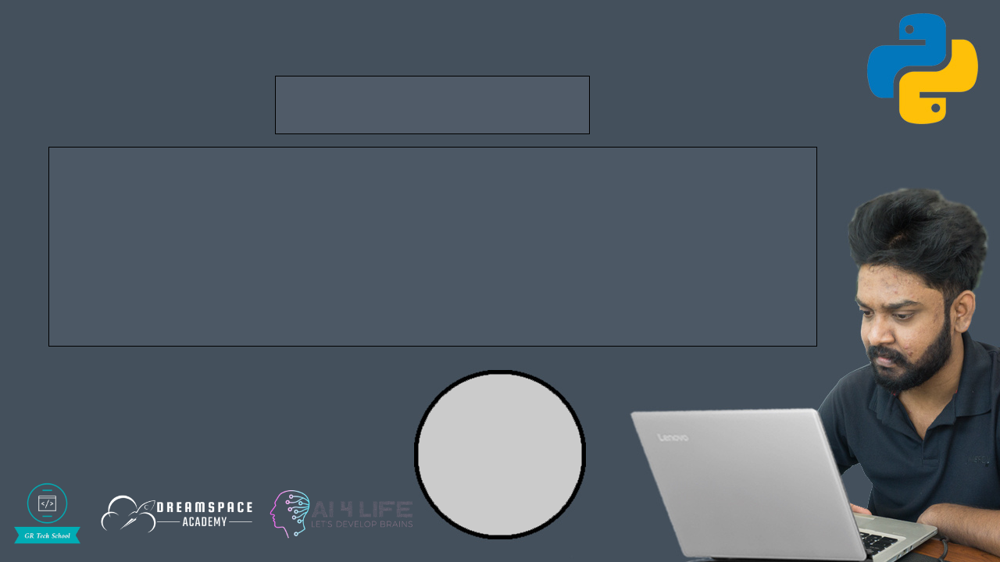

### Output

**Note** As outputs, the system generates images with tutorial numbers and tutorial headings from the given .txt files, but if we are writing more than 1 text elements into a base template, the number of texts must be same, for an example, if we want to generate 60 posters, we need to give 60 text elements for tutorial numbers, and 60 text elements for tutorial headings. We can call one processing as a batch. We can write many text elements as we want, but the number of texts in element must match with others.


### Text files inputs


#### Tutorial number data text file

**Note:** This number-data.txt file contains numbers to be placed on the first box.


#### Tutorial heading data text file

**Note:** This data-without-number.txt file contains tutorial headings to be placed on the second big box.


**IMPORTANT NOTE:** Like this, we can generate poster according to our needs with many numbers of text elements.

### How can we use this system?

### Chose a template

**Note 01:** For the demonstration purpose, this simple template has been chosen, here we need to write (name, to, form, amount, signature) in this voucher template. Let's think, we have to generate 1000 voucher for 1000 people, editing one by one is hard, therefore, we are going to use this system to generate vouchers based on a template.

**Note 02:** We are going to generate 10 vouchers for the demonstration.


#### Create data for to, form, amount and signature.

##### 01 to-list.txt

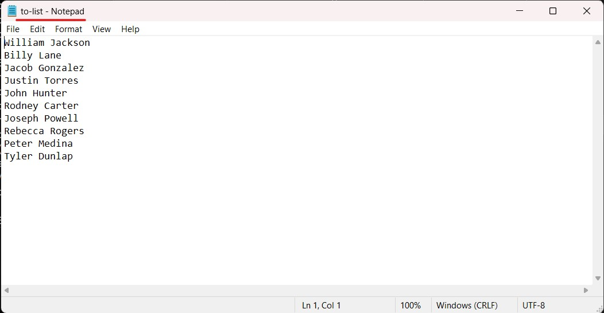


##### 02 from-list.txt

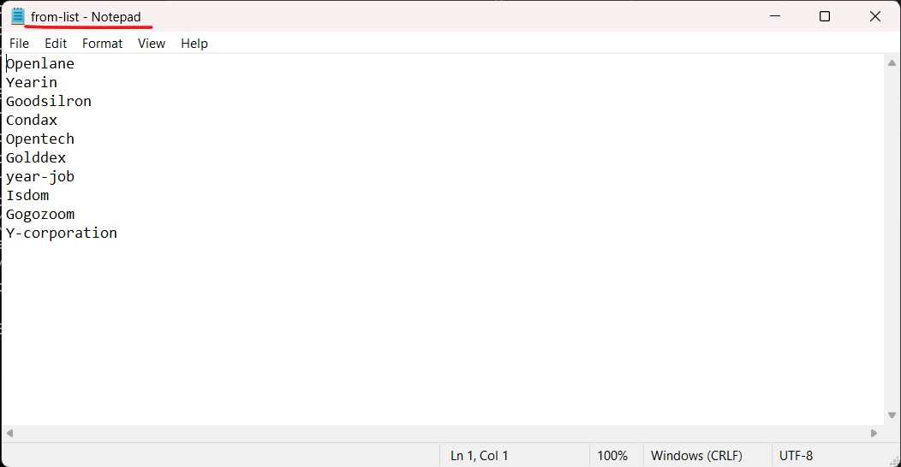

##### 03 amount-list.txt

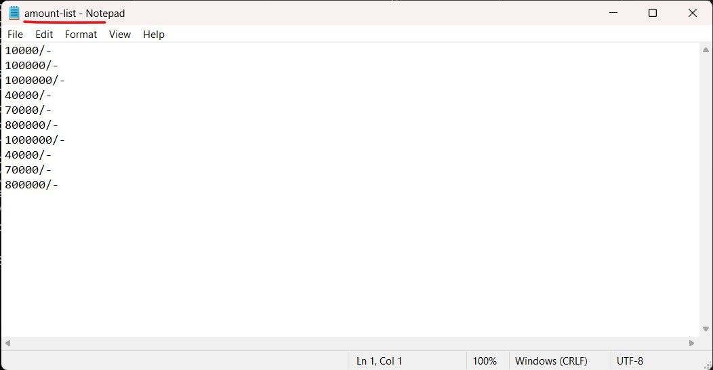


##### 04 signature-list.txt

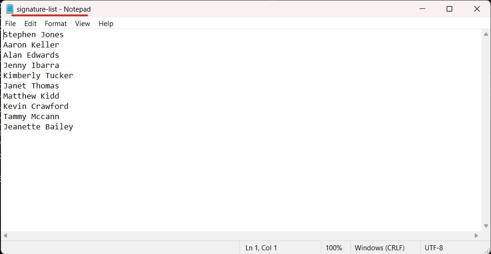


**Note:** to-list.txt, from-list.txt, amount-list.txt and signature-list.txt, all text files must contains same number of text items in it.

#### Get X1 Y1 X2 Y2 coordinates from the template

To get the coordinates from the base template, we can use the Windows print application that is come with Windows OS, we can also use Photoshop or editing tools to get the coordinates.


**Note 1** Open print application, load the base template in it, and move the mouse to get the X,Y coordinates.

**Note 2** We need to get the X1, Y1 (Starting Point), X2, Y2 (Ending Point) coordinates from the base template.

#### Example of X1, Y1, X2, Y2 Coordinates

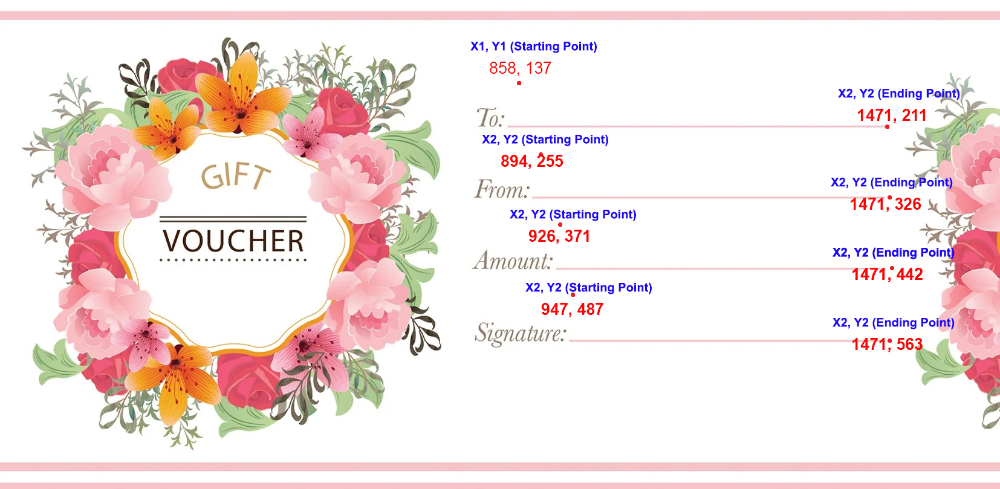

**Note** This is a sample explanation of starting and ending point coordinates (X1, Y1 X2, Y2).


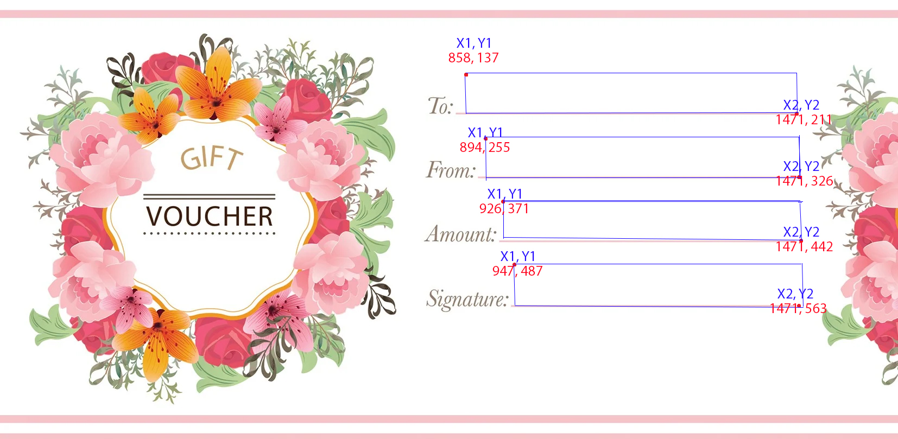

**Note** We need to get (X1, Y1 X2, Y2) coordinates as a box shape, example is shown above.


- TO        = 858, 137 (Starting Point) | 1471, 211 (Ending Point)
- FROM      = 894, 255 (Starting Point) | 1471, 326 (Ending Point)
- AMOUNT 	  = 926, 371 (Starting Point) | 1471, 442 (Ending Point)
- SIGNATURE = 947, 487 (Starting Point)  | 1471, 563 (Ending Point)


**Note:** After selecting coordinates, it's time to generate posters.

### Open Auto_Poster_Generator.exe

- This exe file is found on the following directory.
```
"auto-poster-generator/0-auto-poster-generator-design-vs/Auto_Poster_Generator/Auto_Poster_Generator/bin/Debug/Auto_Poster_Generator.exe"
```

#### Loading Screen

**Note:** This is the loading screen, it runs at the beginning of the program.

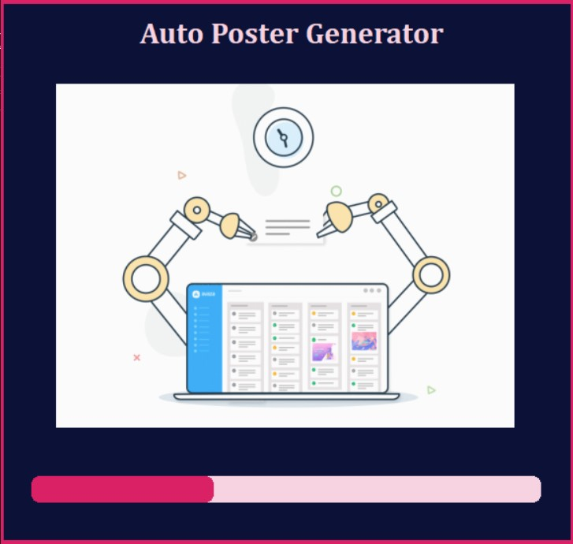


#### Dashboard Structure

**Note:** This is the main dashboard of the system, here we need to enter text data to generate posters.


#### Input data

**Note:** In this Window, we have to enter the text elements' data such as coordinates, text-align, text color, text size etc.

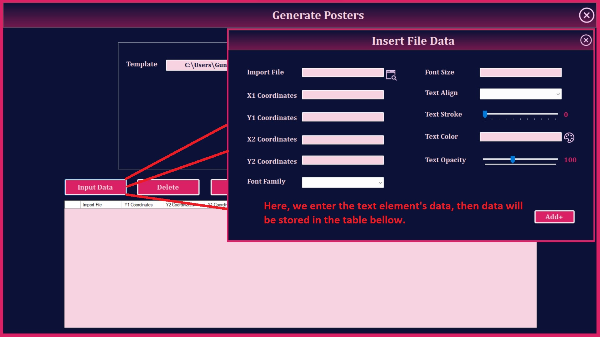


#### Example of generating posters

**Note** You can find a folder called "3-test-sample-data" in this repository, in the folder, there is a base template and text files that are used to generate sample posters for testing purpose.  

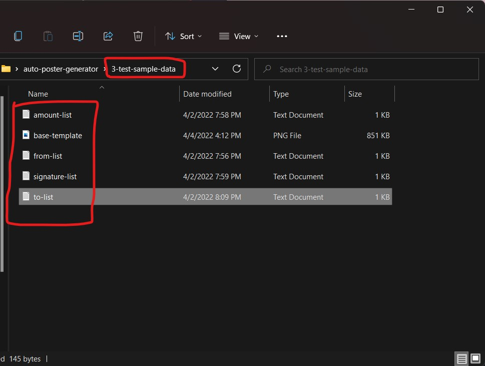

- base-template
- amount-list
- from-list
- to-list
- signature-list

##### base-template


**Note:** We are going to use this template for a sample testing. There are files such as amount-list.txt, from-list.txt, to-list.txt, signature-list.txt, these files could be used to generate posters.


#### Step:01 Import the base-template

**Note:** Open the system and this template.


#### Step:02 Import data of "to" from "to-list.txt"

**Note:** click the import data and enter all of the coordinates (X1,Y1,X2,Y2) and load to-list.txt file.

**Load to-list.txt** Load the to-list.txt file as a text element.

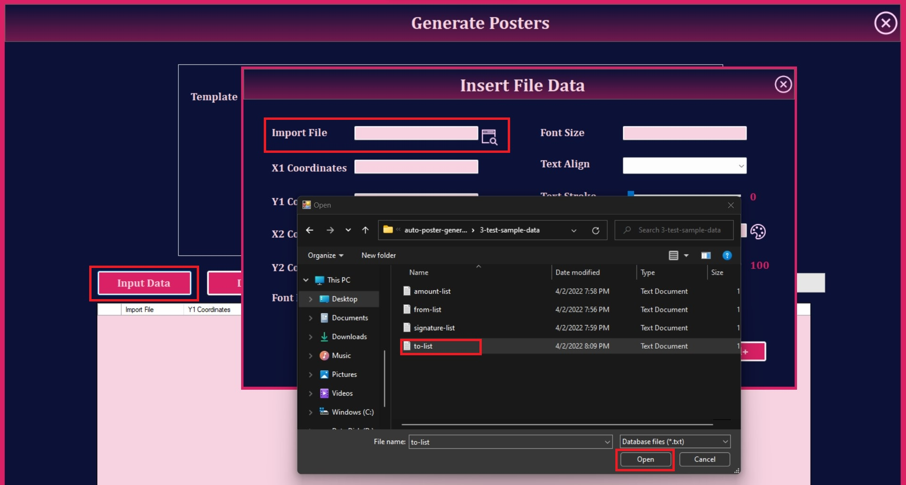

**Enter text elements data** Enter coordinates, font-color, font-size and other text element data.


#### Step:03 Import data of "from" from "from-list-list.txt"

**Note:** click the import data and enter all of the coordinates (X1,Y1,X2,Y2) and load from-list.txt file.


**Load from-list.txt** Load the from-list.txt file as a text element.


**Enter text elements data** Enter coordinates, font-color, font-size and other text element data.

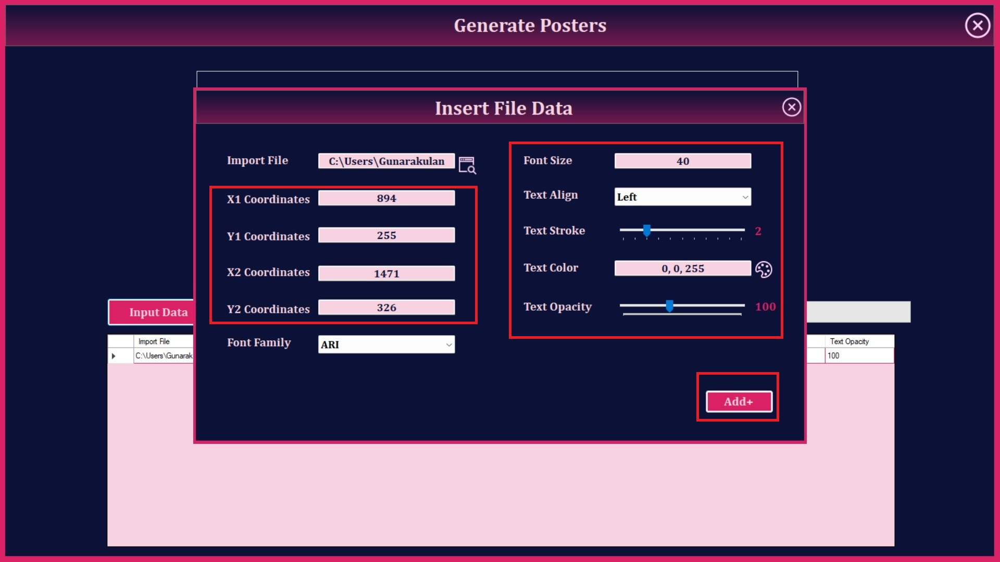

#### Step:04 Import data of "amount" from "amount-list-list.txt"

**Note:** click the import data and enter all of the coordinates (X1,Y1,X2,Y2) and load amount-list.txt file.


**Load amount-list.txt** Load the from-list.txt file as a text element.


**Enter text elements data** Enter coordinates, font-color, font-size and other text element data.

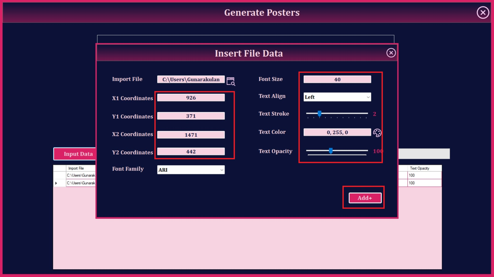

#### Step:04 Import data of "signature" from "signature-list-list.txt"

**Note:** click the import data and enter all of the coordinates (X1,Y1,X2,Y2) and load amount-list.txt file.


**Load signature-list.txt** Load the from-list.txt file as a text element.


**Enter text elements data** Enter coordinates, font-color, font-size and other text element data.

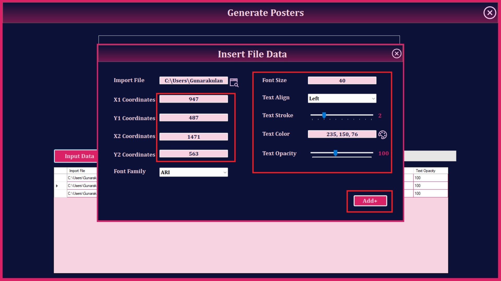

### Ready to generate posters.

**Note** After insetting all text elements data and text files, now we are start the processing to generate posters.

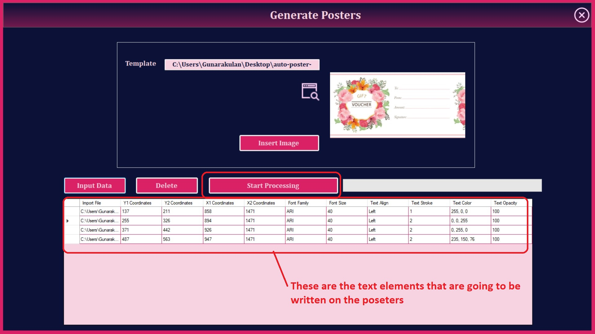


### Outputs

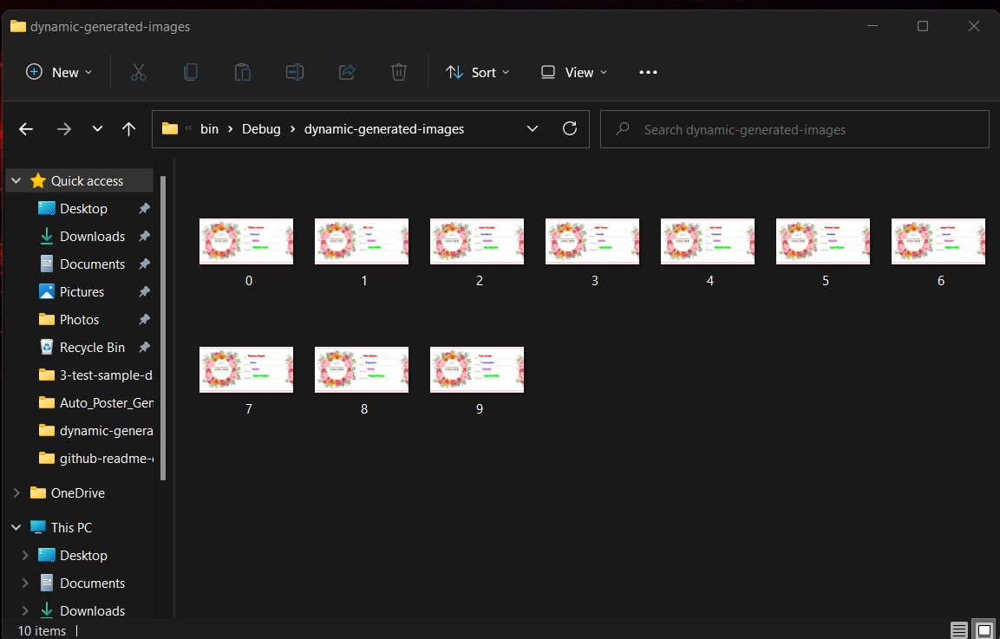

**Note** After clicking the "Start Processing" button, it generates all of the posters.

### Sample poster

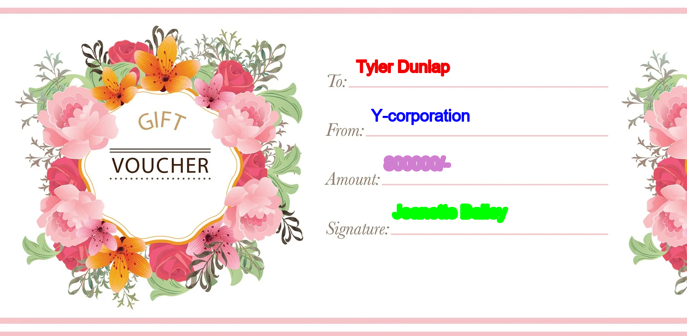

**Note** We have increased the stroke for amount and signature, therefore it looks much ticker. By using this poster generator system we can generate certificates, banners and etc.


## Technical Explanation of System

Python and C# are used to develop this system. Python is the major programming language that does the poster generation part of the system. C# is for management side of the system where we used to add coordinates, text color, font size and etc.

- Python - Responsible for poster generation.
- C#     - Responsible for management (Add coordinates and other text element data).


C# write all the text elements data in a text file (dynamic_input_data.txt) then, python script reads that text file to generate posters.

There are 3 main txt files are in this system that are used to make a connection between Python and C#.

- **dynamic_input_data.txt :** Stores all text elements' inputs such as coordinates, color, size and etc.

- **dynamic_config.txt :** This text file contains template path, number of poster count and number of iterations and etc.

- **process_status.txt :** It updates progress bar status to be read and displayed by C#.

### 01 dynamic_input_data.txt File

This file contains text element's data such as (X1, Y1, X2, Y2) coordinates, text color, text size, text stroke, opacity and etc, then Python reads this text file and generate posters based on it.

**Note** dynamic_input_data.txt file is created by the C#.

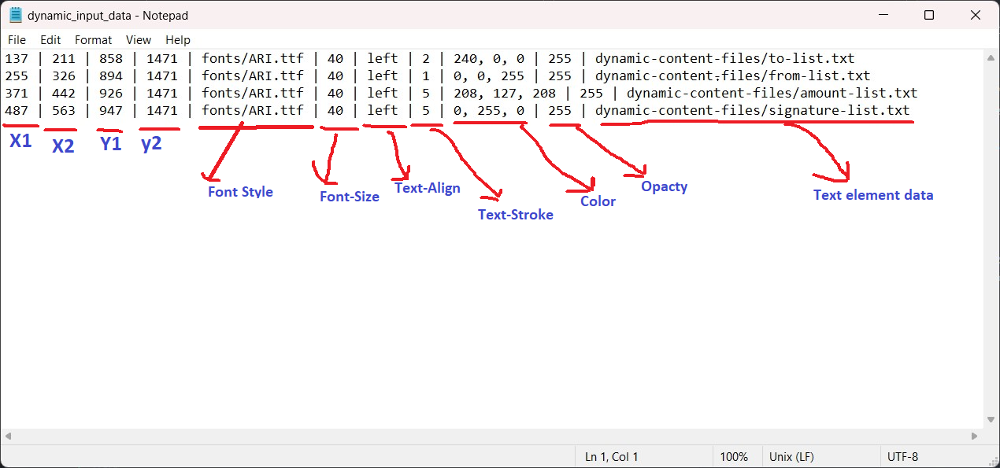

### 02 dynamic_config.txt File

This file contains number of posters that it needs to generate, number of iterations (Number of batches), template path.

**Note** dynamic_config.txt file is created by the C#.


### 03 process_status.txt File

This file updates the progress bar status while the poster generation part is running, then the C# reads this text file to graphically shows the progress bar.

**Note** process_status.txt file is created by the C#.


## Execution & Running

### Run Method 1

```
Execute Auto_Poster_Generator.exe found in "auto-poster-generator/0-auto-poster-generator-design-vs/Auto_Poster_Generator/Auto_Poster_Generator/bin/Debug/"
```

### Run Method 2

```
Open the project in Visual Studio and click debugging to run the project.
```


Social Media Links
---

* [Linkedin Profile](https://www.linkedin.com/in/gunarakulangunaretnam/)
* [Facebook Page](https://www.facebook.com/gunarakulangunaretnam)
* [Twitter Profile](https://twitter.com/gunarakulang)
* [Instagram Profile](https://www.instagram.com/gunarakulangunaretnam/)
* [Youtube Channel](https://www.youtube.com/channel/UCMWkED5sabgVZSCKjZuRJXA)
